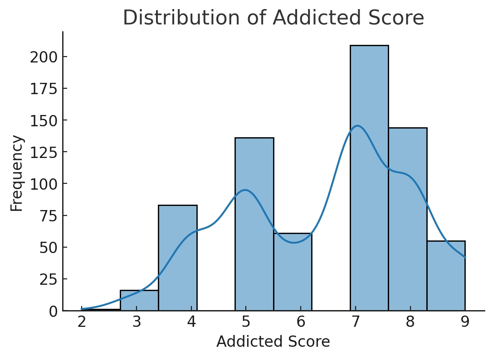

# Students Social Media Addiction Analysis

[](https://www.python.org/)
[](https://jupyter.org/)
[](LICENSE)

---

## 📊 Project Overview
This project analyzes a dataset of students' social media usage, addiction scores, mental health, and demographics.
It includes data cleaning, feature engineering, exploratory data analysis (EDA), and visualizations that reveal patterns and insights.



---

## 📂 Table of Contents
1. [Project Features](#project-features)
2. [Installation](#installation)
3. [Usage](#usage)
4. [Key Insights](#key-insights)
5. [File Structure](#file-structure)
6. [License](#license)

---

## 🚀 Project Features
- Data cleaning & datatype optimization
- Feature engineering: **Risk_Level** and **Detox_Strategy**
- Visualizations: histograms, scatterplots, boxplots, heatmaps, and pie charts
- Insights on relationships between social media usage, academic performance, and mental health
- Ready-to-run **Jupyter Notebook** and **Python script**

---

## 💻 Installation
```bash
# Clone the repository
git clone https://github.com/your-username/social-media-addiction-analysis.git

# Navigate into the folder
cd social-media-addiction-analysis

# Install dependencies
pip install -r requirements.txt
```

---

## 📈 Usage
To run the analysis in **Jupyter Notebook**:
```bash
jupyter notebook analysis.ipynb
```

Or run the Python script:
```bash
python analysis.py
```

---

## 📊 Key Insights
- Most students have addiction scores between 5 and 8 → **Moderate to High risk**
- Younger students (15–22) tend to have **higher addiction levels**
- Higher addiction correlates with **less sleep** and **lower academic performance**
- High school students showed **highest average addiction scores**
- Recommended actions: limit usage time, promote offline activities, digital detox challenges

---

## 📁 File Structure
```
social-media-addiction-analysis/
│── analysis.ipynb              # Main notebook with analysis & plots
│── analysis.py                  # Python script version of the notebook
│── Students Social Media Addiction.csv  # Dataset
│── requirements.txt             # Python dependencies
│── overview_plot.png            # Preview image for README
│── README.md                    # Project documentation
│── LICENSE                      # License file
```

---

## 📜 License
This project is licensed under the MIT License - see the [LICENSE](LICENSE) file for details.
